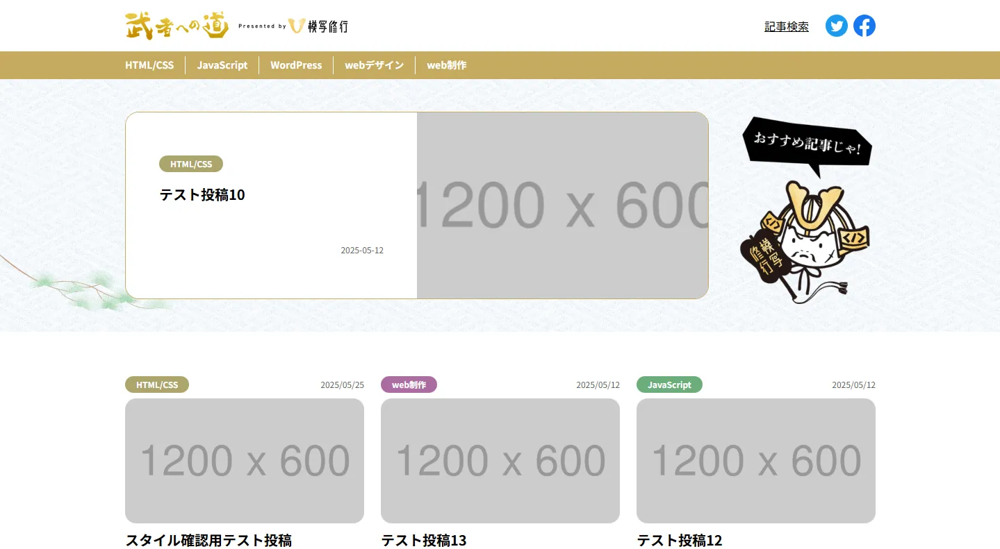

# 🧩 MediaSite 武者への道 – Web Coding Demo（架空サイト）



## 🔗 Demo

【 URL 】
[https://musha-road.omiportfolio.com/](https://musha-road.omiportfolio.com/)

&nbsp;

## 📝 Overview（概要）

HelloMentor 課題として制作した **メディア系 Web サイト**です。
**WordPress テーマとして PHP 化**し、メディア運用を想定した機能を実装しています。

- WordPress 環境構築（Local）
- PHP によるテンプレート化・記事ループ・検索ロジックの実装
- 記事のキーワード検索機能を実装
- カテゴリ内おすすめ記事（最大 6 件）のランダム表示
- トップページのおすすめ記事を管理画面から変更可能
- 必要なプラグイン導入による CMS の最適化
- 保守性を意識した CSS 設計手法 + SCSS 運用

&nbsp;

## 🛠️ Tech Stack（使用技術）

<p align="left">
  
  
  
  
  
   
</p>

&nbsp;

## ✨ Features（制作ポイント）

### 1. WordPress テーマ化

- テンプレート階層に沿って front-page.php / single.php / page.php / 404.php 等を構成
- loop や条件分岐を用いた記事一覧・記事詳細の出力
- search.php による検索結果ページの作成

### 2. カテゴリ内おすすめ記事（最大 6 件）のランダム表示

- 閲覧中の記事のカテゴリを取得
- 同一カテゴリからランダムに 6 件抽出し表示
- メディアサイト運用を想定した設計

### 3. 管理画面の操作性を改善（CMS 最適化）

- トップページの「おすすめ記事」を管理画面から変更可能
- 実務を想定し必要なプラグインを導入

### 4. 基本機能の整備

- パンくずリスト
- 記事検索
- Contact Form 7 による問い合わせ対応
- SEO SIMPLE PACK によるメタ設定
- 投稿記事のフロントとエディターの見た目を統一

  &nbsp;

## 📂 Directory（主な構成）

```text
.
├── 404.php
├── footer.php
├── front-page.php
├── functions.php
├── header.php
├── index.php
├── page.php
├── search.php
├── single.php
├── style.css
├── assets
│   ├── css
│   │   ├── editor-style.css
│   │   ├── main.css
│   │   └── main.css.map
│   ├── img
│   ├── js
│   │   └── main.js
│   └── scss
├── template-parts
│   ├── breadcrumb.php
│   └── loop-article.php

```

## 💻 Development Environment（開発環境）

- Local by Flywheel（WordPress）
- VSCode / GitHub Copilot / Gemini Code Assist
- SCSS / Live Sass Compiler
- ES Modules
- ホットリロード環境（node_modules / BrowserSync）

&nbsp;

## ⚠️ Notes（注意事項）

- 本テーマは学習用に制作しています。

&nbsp;
